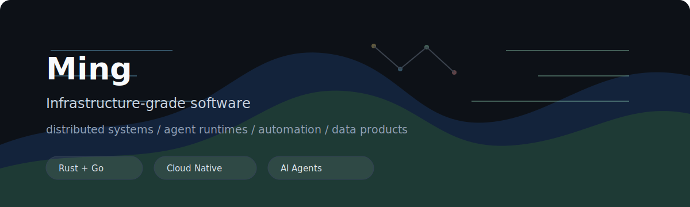

# Ming

I build infrastructure-grade software: distributed systems, agent runtimes, automation tools, and data products.

Currently focused on AI agent systems, cloud-native runtime engineering, and market/data infrastructure.

  
  
  
  

## Selected Work

| Project | Notes |
| --- | --- |
| [MineKV](https://github.com/SimonMing47/MineKV) | Distributed KV database experiment. |
| [agent-world](https://github.com/SimonMing47/agent-world) | Agent product/runtime exploration. |
| [openticker](https://github.com/SimonMing47/openticker) | Market data and trading infrastructure experiments. |
| [Helix](https://github.com/SimonMing47/Helix) | Systems and tooling workspace. |
| [codemint-blog](https://github.com/SimonMing47/codemint-blog) | Notes on engineering, products, and systems. |

## Areas

Distributed storage, container runtimes, Linux, Kubernetes, Rust, Go, TypeScript, Python, AI agents, trading systems.

## Principles

- Build small systems that can survive real use.
- Prefer clear interfaces over clever machinery.
- Keep shipping, keep measuring, keep simplifying.

## Contact

GitHub: [@SimonMing47](https://github.com/SimonMing47)  
Email: [mingxing.tc@gmail.com](mailto:mingxing.tc@gmail.com)
